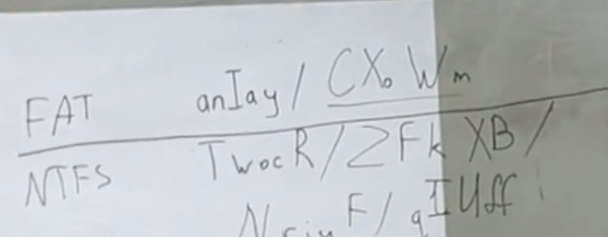
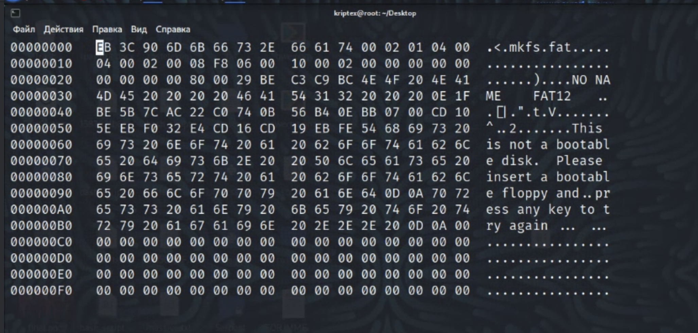

Fat 12

нужный файл:

1)hexedit -s fat.img

2) ищем нужную папку перыую(ручками хуярим)

   

там короч атрибут сука 10 это папка ебанная

папка не имеет них размера так как она динамическая бять!!!!!

и она сука указывает на ардрес 0x0053

нужно туда перейьти используем питончик

3)

ищем область данных

0x200 * 4 + 4 * 6 * 512 + 512 * 32  = 0x7800

благодаря области данных можем перейти в нужную папку 

переходим бляха муха в папку 

0x7800 + (0x53 - 2) * 512 * 1 = 0x11a00 

это короче сама паппка со всеми данными рот их ебал

и теперь нам нужен тот файл 

4)

нашли нужный файл так как умеем работать ручками

размер файла 0x8F6

первый кластер 0х58 это первый кластер нашей цепочки (уххх какая сучка)

5)

используем фат таблицу что бы собрать цепоски и используем первую цепочку

0x800 + 0x58*1.5 = 0x884 

0х73

0x800 + 0x73 * 1.5 = 2220.5

у нас получается не ровно потому берём правую часть

 мы берём правую часть

получается 0хAD0